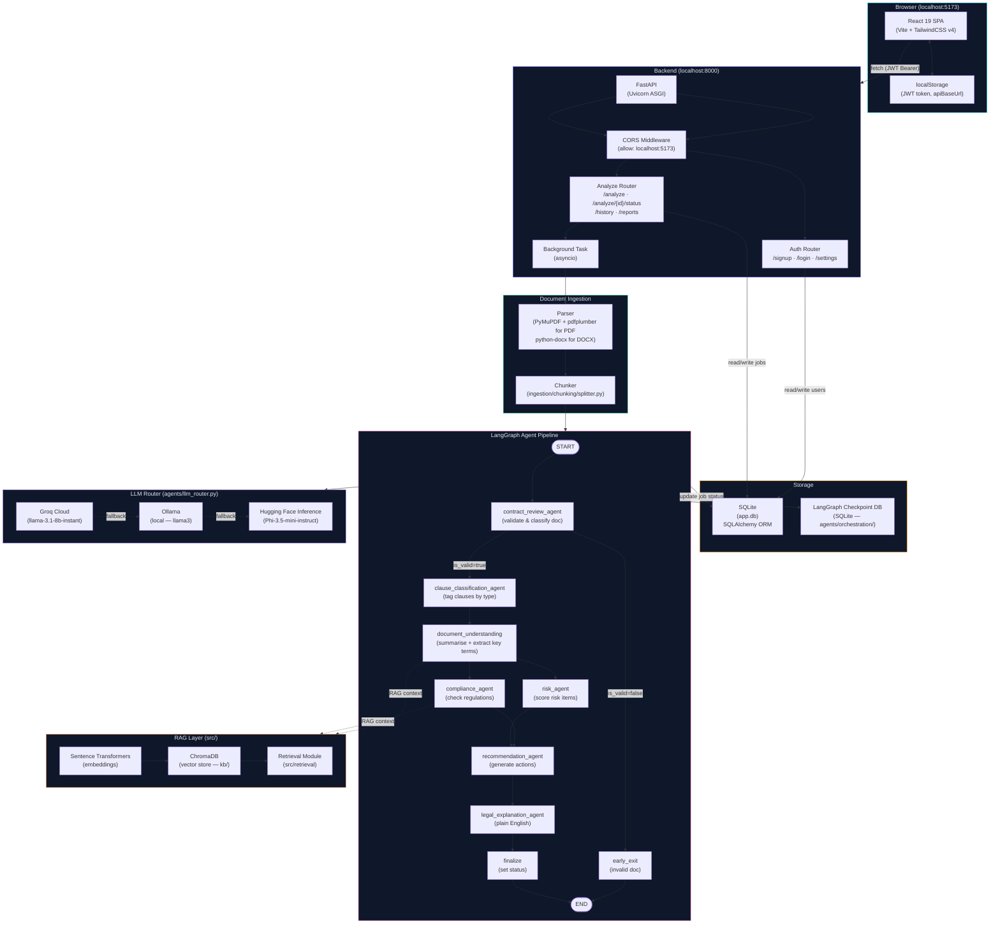

# Contract Review — Developer Documentation

> **Version:** 0.1.0 · **Last updated:** July 2026 
> Audience: Backend engineers, frontend engineers, ML/AI engineers

---

## Table of Contents

1. [System Overview](#1-system-overview)
2. [System Architecture Diagram](#2-system-architecture-diagram)
3. [Tech Stack](#3-tech-stack)
4. [Directory Structure](#4-directory-structure)
5. [Backend — FastAPI](#5-backend--fastapi)
6. [Agent Pipeline — LangGraph](#6-agent-pipeline--langgraph)
7. [LLM Router](#7-llm-router)
8. [Document Ingestion & RAG](#8-document-ingestion--rag)
9. [Frontend — React + Vite](#9-frontend--react--vite)
10. [API Reference](#10-api-reference)
11. [Data Models](#11-data-models)
12. [Environment Variables](#12-environment-variables)
13. [Local Development Setup](#13-local-development-setup)
14. [Known Issues & Fixes](#14-known-issues--fixes)

---

## 1. System Overview

Contract Review is a **multi-agent AI application** that automatically reviews employment/legal contracts. A user uploads a PDF or DOCX file; the backend parses, chunks, and passes it through a sequential **LangGraph** agent graph that performs clause classification, compliance checking, risk scoring, recommendation generation, and plain-English legal explanation. Results are persisted in SQLite and polled by the React frontend.

**Key design decisions:**
- Agents are **stateless functions** wired together by LangGraph — easy to add/remove/reorder.
- LLM calls are routed through a **priority waterfall**: Groq Cloud → Ollama (local) → HuggingFace — so the system works with or without a cloud API key.
- The backend uses **FastAPI background tasks** (not Celery) to keep infrastructure simple.
- The frontend polls the status endpoint every 3 s rather than using WebSockets.

---

## 2. System Architecture Diagram



---

## 3. Tech Stack

### Backend

| Layer | Technology | Version | Notes |
|---|---|---|---|
| Web framework | **FastAPI** | ≥ 0.115 | Async, auto-docs at `/docs` |
| ASGI server | **Uvicorn** | ≥ 0.32 | `[standard]` extras for WebSocket support |
| Agent orchestration | **LangGraph** | ≥ 1.2.9 | `StateGraph` with async nodes |
| Agent checkpointing | **langgraph-checkpoint-sqlite** | ≥ 3.1 | Persists mid-run state |
| LLM (primary) | **Groq Cloud** | API | `llama-3.1-8b-instant` — fastest, free tier |
| LLM (local fallback) | **Ollama** | — | `llama3` running on `localhost:11434` |
| LLM (cloud fallback) | **HuggingFace Inference** | API | `microsoft/Phi-3.5-mini-instruct` |
| HTTP client | **httpx** | ≥ 0.27 | Async, used by LLM router |
| PDF parsing | **PyMuPDF + pdfplumber** | ≥ 1.24 / 0.11 | Dual-parser for best text extraction |
| DOCX parsing | **python-docx** | ≥ 1.1 | Handles `.docx` / `.docm` |
| Vector store | **ChromaDB** | ≥ 0.5 | Persisted locally in `kb/` |
| Embeddings | **sentence-transformers** | ≥ 3.0 | Local embedding model |
| ORM | **SQLAlchemy** | ≥ 2.0 | Declarative models |
| Database | **SQLite** | built-in | `app.db` — upgrade to Postgres for prod |
| Auth | **python-jose + passlib[bcrypt]** | ≥ 3.3 / 1.7 | JWT HS256, bcrypt password hashing |
| Validation | **Pydantic** | ≥ 2.0 | Request/response schemas |
| Config | **python-dotenv** | ≥ 1.0 | Loads `.env` at startup |

### Frontend

| Layer | Technology | Version | Notes |
|---|---|---|---|
| UI framework | **React** | 19.x | Concurrent mode |
| Build tool | **Vite** | 8.x | HMR, dev proxy to FastAPI |
| Routing | **react-router-dom** | 7.x | `BrowserRouter` with nested routes |
| Styling | **TailwindCSS** | 4.x | Via `@tailwindcss/vite` plugin |
| Component library | **shadcn/ui + Base UI** | 3.x / 1.x | Headless + styled primitives |
| Icons | **lucide-react** | 1.x | — |
| Font | **Geist Variable** | — | Via `@fontsource-variable/geist` |
| Linting | **ESLint + oxlint** | 8.x / 1.x | Dual linter setup |

---

## 4. Directory Structure

```
Contract-Review-dev/
├── main.py # FastAPI app entrypoint, CORS, router registration
├── requirements.txt # Python dependencies
├── app.db # SQLite database (users, analysis jobs)
├── .env # ← YOU must create this (see §12)
│
├── api/ # FastAPI route handlers
│ ├── analyze.py # /analyze, /analyze/{id}/status, /history, /reports
│ ├── auth.py # /signup, /login, /settings (JWT auth)
│ ├── database.py # SQLAlchemy engine + session factory
│ └── models.py # ORM models: User, AnalysisJob
│
├── agents/ # LLM agent implementations
│ ├── llm_router.py # Groq → Ollama → HF waterfall
│ ├── contract_review_agent.py # Gate: validates the doc is a contract
│ ├── clause_classification_agent.py # Tags each clause by type
│ ├── document_understanding_agent.py# Summarises doc, extracts key terms
│ ├── compliance_agent.py # Checks against regulatory frameworks
│ ├── risk_agent.py # Scores risk per clause
│ ├── recommendation_agent.py # Generates actionable recommendations
│ ├── legal_explanation_agent.py # Plain-English explanations
│ ├── schemas.py # Pydantic schemas shared by agents
│ └── orchestration/
│ ├── orchestration.py # LangGraph StateGraph definition
│ └── orchestration.md # Agent graph design notes
│
├── ingestion/ # Document parsing + chunking
│ ├── parsers/
│ │ ├── pdf_parser.py # PyMuPDF + pdfplumber
│ │ └── docx_parser.py # python-docx
│ └── chunking/
│ └── splitter.py # Splits ParseResult into text chunks
│
├── src/ # RAG infrastructure
│ ├── embeddings/ # Sentence-transformer wrapper
│ ├── vectordb/ # ChromaDB client
│ ├── retrieval/ # Query + re-rank
│ ├── ingestion/ # KB ingestion pipeline
│ └── metadata/ # Document metadata store
│
├── kb/ # ChromaDB persisted vector data
├── schemas/
│ └── api_models.py # Shared Pydantic API response models
│
└── frontend/
 └── frontend/ # React application root
 ├── vite.config.js # Build config + dev proxy to :8000
 ├── src/
 │ ├── App.jsx # Router setup
 │ ├── lib/api.js # All fetch() calls to the backend
 │ ├── hooks/useLocalStorage.js
 │ └── pages/
 │ ├── AnalysisPage.jsx # Upload + polling UI
 │ ├── LoginPage.jsx
 │ ├── SignupPage.jsx
 │ ├── HistoryPage.jsx
 │ ├── ReportsPage.jsx
 │ ├── PreviewPage.jsx
 │ └── SettingsPage.jsx # API base URL config
 └── components/
 ├── AppShell.jsx # Sidebar layout wrapper
 └── UploadZone.jsx # Drag-and-drop file input
```

---

## 5. Backend — FastAPI

### Entry point — `main.py`

```
load_dotenv()
 └── api.models ──► create_all() on SQLite
 └── CORS middleware (allow_origins: localhost:5173)
 └── include_router(auth.router)
 └── include_router(analyze.router)
 └── GET /health
```

> [!IMPORTANT]
> `load_dotenv()` runs **before** all other imports because `agents/llm_router.py` reads `GROQ_API_KEY` at import time. Import order in `main.py` must not be changed.

### Authentication — `api/auth.py`

- `POST /signup` — JSON body `{email, password}` → bcrypt hash → store User → `201 UserResponse`
- `POST /login` — **form-encoded** `username + password` (OAuth2 spec) → JWT HS256 → `Token`
- `GET /settings` — Bearer token → current `UserResponse`
- Tokens expire in **7 days** by default (`ACCESS_TOKEN_EXPIRE_MINUTES = 60*24*7`)

### Analysis Jobs — `api/analyze.py`

| Step | Detail |
|---|---|
| **1. Validate extension** | `.pdf`, `.docx`, `.docm` only |
| **2. Write to temp file** | `tempfile.NamedTemporaryFile` |
| **3. Create DB job** | `status = "pending"` |
| **4. Queue background task** | `BackgroundTasks.add_task(process_contract_background)` |
| **5. Return immediately** | `{contract_id, status: "pending"}` |
| **6. Background: parse** | `get_parser()` → `parser.parse()` |
| **7. Background: chunk** | `chunk_parse_result()` |
| **8. Background: agents** | `run_contract_review(state, thread_id=contract_id)` |
| **9. Background: update DB** | `_update_job_status(contract_id, status, result)` |

---

## 6. Agent Pipeline — LangGraph

The graph is built once and compiled with an **AsyncSqliteSaver** checkpointer so that intermediate state is preserved across agent steps.

### Execution Flow

```
START
 └─► contract_review_agent ← Validates the document is a contract
 ├─ is_valid=False ─► early_exit ─► END (no further processing)
 └─ is_valid=True ─► clause_classification_agent
 └─► document_understanding (async)
 ├─► compliance_agent ─┐
 └─► risk_agent ───────┤
 ▼
 recommendation_agent
 │
 legal_explanation_agent
 │
 finalize ─► END
```

### `ContractReviewState` — shared TypedDict

| Field | Type | Written by |
|---|---|---|
| `contract_id` | `str` | API layer |
| `raw_text` | `str` | API layer |
| `chunks` | `List[str]` | API layer |
| `file_metadata` | `Dict` | API layer |
| `contract_metadata` | `Dict` | `contract_review_agent` |
| `is_valid_contract` | `bool` | `contract_review_agent` |
| `classified_clauses` | `List[Dict]` | `clause_classification_agent` |
| `document_summary` | `str` | `document_understanding_agent` |
| `key_terms` | `Dict` | `document_understanding_agent` |
| `retrieved_context` | `List[Dict]` | RAG retrieval |
| `compliance_results` | `Dict` | `compliance_agent` |
| `risk_results` | `Dict` | `risk_agent` |
| `recommendations` | `List[Dict]` | `recommendation_agent` |
| `legal_explanations` | `List[Dict]` | `legal_explanation_agent` |
| `errors` | `List[Dict]` | All agents (append-only) |
| `completed_steps` | `List[str]` | All agents (append-only) |
| `status` | `Literal` | `finalize` / `early_exit` |

### Error Handling

Every agent node is wrapped in `_safe_call()`. If an agent raises an exception, it is caught, logged, appended to `state["errors"]`, and execution continues. The final status will be `completed_with_errors` instead of `completed`.

---

## 7. LLM Router

**File:** `agents/llm_router.py`

All agents call `await chat(messages, format="json")` — they never import a specific provider.

```
chat(messages)
 1. Try Groq Cloud (GROQ_API_KEY required — llama-3.1-8b-instant)
 ↓ exception
 2. Try Ollama (requires local daemon on port 11434 — llama3)
 ↓ exception
 3. Try HuggingFace (HF_API_TOKEN optional — Phi-3.5-mini-instruct)
 ↓ exception
 4. Return "{}" / empty string (agents handle gracefully)
```

`chat_json()` wraps `chat()` to parse and return a Python dict/list. The `StructuredLLM` class provides a `get_structured_llm(schema)` compatibility shim for agents that expect a Pydantic-schema-based LLM.

---

## 8. Document Ingestion & RAG

### Parsing

| Format | Primary parser | Fallback |
|---|---|---|
| `.pdf` | PyMuPDF (`fitz`) | pdfplumber |
| `.docx` / `.docm` | python-docx | — |

All parsers return a `ParseResult(full_text, metadata)` object.

### Chunking — `ingestion/chunking/splitter.py`

`chunk_parse_result(parsed, source_name)` splits `full_text` into `Chunk` objects. Chunks are passed as `state["chunks"]` to the agent graph.

### RAG — `src/`

| Module | Role |
|---|---|
| `src/embeddings/` | Wraps `sentence-transformers` to produce vectors |
| `src/vectordb/` | ChromaDB client; persists to `kb/` |
| `src/ingestion/` | Offline KB ingestion (run via `build_kb.sh`) |
| `src/retrieval/` | Similarity search called by `document_understanding_agent` and `compliance_agent` |

> [!NOTE]
> Run `./build_kb.sh` to populate the ChromaDB knowledge base before starting the backend. Without this, RAG context will be empty and agents will rely solely on their LLM prompt.

---

## 9. Frontend — React + Vite

### Routing (App.jsx)

```
/ → HomePage
/analysis → AnalysisPage (upload + poll)
/preview → PreviewPage (contract text view)
/reports → ReportsPage (completed reports)
/history → HistoryPage (all jobs)
/login → LoginPage
/signup → SignupPage
/settings → SettingsPage (API base URL, theme)
```

All routes are wrapped in `<AppShell />` which renders the sidebar nav.

### API Client — `src/lib/api.js`

All network calls go through this module. Pages pass `apiBaseUrl` (from `useLocalStorage`) as a parameter so the user can point the frontend at any backend URL from the Settings page.

| Function | Method | Endpoint |
|---|---|---|
| `startAnalysis(file, baseUrl)` | `POST` | `/analyze` |
| `checkAnalysisStatus(id, baseUrl)` | `GET` | `/analyze/{id}/status` |
| `fetchReports(baseUrl)` | `GET` | `/reports` |
| `fetchHistory(baseUrl)` | `GET` | `/history` |
| `mapAnalysisResponse(raw)` | — | Client-side transform |
| `generateReportBlob(results, meta)` | — | Client-side `.txt` export |

### Auth Flow

```
POST /login (form-encoded)
 └─ stores token → localStorage['token']
 └─ stores {email} → localStorage['currentUser']

getAuthHeaders() ← reads localStorage['token']
 └─ { Authorization: 'Bearer <token>' }

All protected requests attach this header automatically.
```

### Vite Dev Proxy (vite.config.js)

The following routes are proxied from `localhost:5173` to `localhost:8000` so the browser never makes a cross-origin request during development:

```
/analyze /login /signup /settings /history /reports /health
```

---

## 10. API Reference

### Auth

| Method | Path | Auth | Request | Response |
|---|---|---|---|---|
| `POST` | `/signup` | | `{email, password}` JSON | `{id, email}` |
| `POST` | `/login` | | form-encoded `username + password` | `{access_token, token_type}` |
| `GET` | `/settings` | Bearer | — | `{id, email}` |

### Analysis

| Method | Path | Auth | Request | Response |
|---|---|---|---|---|
| `POST` | `/analyze` | Bearer | multipart `file` | `{contract_id, status: "pending"}` |
| `GET` | `/analyze/{id}/status` | Bearer | — | Status object (see below) |
| `GET` | `/history` | Bearer | — | `Array<Job>` |
| `GET` | `/reports` | Bearer | — | `Array<Job>` (completed only) |

### Health

| Method | Path | Auth | Response |
|---|---|---|---|
| `GET` | `/health` | | `{status: "ok"}` |

### Status Response Schema

```jsonc
{
 "contract_id": "contract-abc123",
 "status": "pending | in_progress | completed | completed_with_errors | failed",

 // Only present when status ∈ {completed, completed_with_errors, failed}:
 "contract_metadata": { ... },
 "compliance_results": {
 "violations": [{ "regulation", "clause_id", "severity", "description" }],
 "missing_requirements": [ "..." ]
 },
 "risk_results": {
 "overall_risk_score": 14, // 0-100 (already normalized by risk_agent)
 "category_risks": { ... },
 "risk_items": [{ "risk_type", "likelihood", "impact", "description" }]
 },
 "recommendations": [{ ... }],
 "legal_explanations": [{ ... }],
 "errors": [{ "agent", "error", "timestamp" }],
 "completed_steps": ["contract_review_agent", "clause_classification_agent", ...]
}
```

---

## 11. Data Models

### SQLAlchemy (`api/models.py`)

**User**
| Column | Type | Notes |
|---|---|---|
| `id` | Integer PK | Auto-increment |
| `email` | String UNIQUE | Login identifier |
| `hashed_password` | String | bcrypt |

**AnalysisJob**
| Column | Type | Notes |
|---|---|---|
| `id` | Integer PK | — |
| `user_id` | FK → User.id | — |
| `contract_id` | String UNIQUE | `contract-{hex12}` |
| `filename` | String | Original upload name |
| `status` | String | `pending / in_progress / completed / completed_with_errors / failed` |
| `result_data` | JSON | Full agent pipeline output |
| `created_at` | DateTime | Auto `now()` |

---

## 12. Environment Variables

Create a `.env` file in the project root (never commit it):

```env
# ── LLM Providers ──────────────────────────────────────────
GROQ_API_KEY=gsk_... # Primary LLM — get free key at console.groq.com
GROQ_MODEL=llama-3.1-8b-instant # Override default model

OLLAMA_BASE_URL=http://localhost:11434 # Local Ollama daemon URL
OLLAMA_MODEL=llama3 # Model pulled in Ollama

HF_API_TOKEN=hf_... # Optional — HuggingFace token for higher rate limits
HF_MODEL=microsoft/Phi-3.5-mini-instruct

# ── Auth ────────────────────────────────────────────────────
JWT_SECRET=change-me-to-a-long-random-string # REQUIRED in production

# ── App ─────────────────────────────────────────────────────
# No additional variables required for local SQLite setup
```

> [!CAUTION]
> The default `JWT_SECRET` is `"super-secret-default-key-change-in-prod"`. **Never deploy without setting a strong secret.** All existing tokens become invalid when the secret changes.

---

## 13. Local Development Setup

### Prerequisites

- Python 3.11+
- Node.js 20+
- (Optional) [Ollama](https://ollama.com) for local LLM fallback
- A [Groq API key](https://console.groq.com) for the primary LLM

### Backend

```bash
# 1. Create and activate virtual environment
python -m venv .venv
source .venv/bin/activate # Windows: .venv\Scripts\activate

# 2. Install dependencies
pip install -r requirements.txt

# 3. Create .env (see §12)
cp .env.example .env # then fill in your keys

# 4. (Optional) Build the RAG knowledge base
./build_kb.sh

# 5. Start the server
uvicorn main:app --reload --port 8000
# Auto-docs available at http://localhost:8000/docs
```

### Frontend

```bash
cd frontend/frontend

# Install dependencies (first time only)
npm install

# Start the dev server (proxies API calls to :8000)
npm run dev
# App available at http://localhost:5173
```

### Ollama (optional — local LLM fallback)

```bash
# Install Ollama, then pull the model
ollama pull llama3

# Ollama runs automatically on localhost:11434
```

---

## 14. Known Issues & Fixes

| # | Severity | Component | Issue | Fix Applied |
|---|---|---|---|---|
| 1 | High | `vite.config.js` | No dev proxy — browser makes cross-origin requests to `:8000`, triggering CORS errors | Proxy added for all API routes |
| 2 | High | `SignupPage.jsx` | Password field rendered before email field — breaks autofill and confuses users | Field order corrected |
| 3 | Medium | `main.py` | `ALLOWED_ORIGINS` only covers `localhost:5173` — any other origin (staging, production) will be CORS-blocked | ️ Add production URL to `ALLOWED_ORIGINS` before deploying |
| 4 | Medium | `api/auth.py` | `JWT_SECRET` defaults to a known weak string — all instances share the same secret if `.env` is not set | ✅ Startup warning added when default is in use; `.env.example` provided. Still: set `JWT_SECRET` in `.env` before deploying |
| 5 | Medium | `agents` | RAG context was not injected (`knowledge_retrieval_agent` commented out) | ✅ Retrieval now runs inside `document_understanding_agent` (populates `retrieved_context`); retriever degrades gracefully when the KB is unbuilt |
| 6 | Low | `api/analyze.py` | `risk_score` in `/history` and `/reports` read the wrong key, always returning `0` | ✅ Fixed to `overall_risk_score` |

### Remediation (this pass)

Beyond the table above, a remediation pass also fixed:
- **Frontend risk score double-normalization** — `mapAnalysisResponse` re-divided
  an already-0–100 `overall_risk_score`; now used directly.
- **Fail-open validation gate** — `contract_review_agent` now fails **closed**
  (rejects) on validation error instead of passing the document through.
- **Status semantics** — invalid documents now terminate as `rejected`
  (distinct from `failed`); surfaced with `intake_notes` and a clear UI message.
- **Auth** — sign-out now clears the JWT; protected routes are guarded by
  `RequireAuth`; `datetime.utcnow()` replaced with timezone-aware calls.
- **Agent quality** — `recommendation_agent` and `legal_explanation_agent` now
  use the LLM (with deterministic fallbacks).
- **Clause fidelity** — a chunk can now yield multiple classified clauses, and
  `section_id`/`heading` are preserved through classification.

---

*Generated from codebase analysis of `Contract-Review-dev` — July 2026;
remediation pass applied September 2026.*
